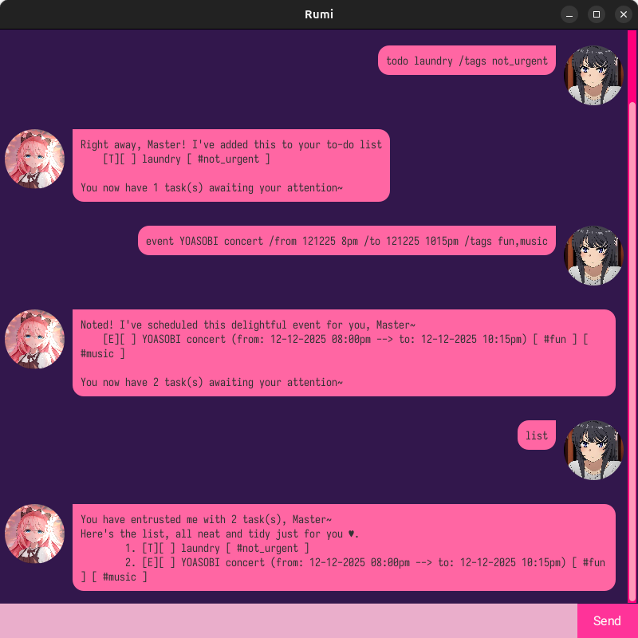

# Rumi User Guide




Rumi is a your ~~typical~~ _**cute**_ :heart: personal assistant that will keep track of your daily to-dos! :calendar:. Most importantly, Rumi would happily live in <ins>under 100MB</ins> of space in any of your computer!

**Features**
- [x]  Managing todos
- [x]  Managing deadlines
- [x]  Managing events
- [ ]  Google Calendar synchronisation (coming soon)

> Time is what we want most but what we use worst. -- William Penn

## Adding todos
Todos are the most basic type of task. It is simply the task name and its status.

Example: `todo clean bedroom /tags not_urgent`

Adds a todo 'clean bedroom' whose status is pending.

```
    ━━━━━━━━━━━━━━━━━━━━━━━━━━━━━━━━━━━━━━━━━━━━━━━━━━━━━━━━━━━━━━━━━━━━━━━━━━
    Right away, Master! I've added this to your to-do list:
        [T][ ] clean bedroom [#not_urgent]
    You now have 5 task(s) awaiting your attention~
    ━━━━━━━━━━━━━━━━━━━━━━━━━━━━━━━━━━━━━━━━━━━━━━━━━━━━━━━━━━━━━━━━━━━━━━━━━━
```

## Date and Time Input
Rumi is a smart chatbot! She understands various natural datetime input format such as:
- `1326 823pm` (Mar 1, 2026 @ 08:23PM)
- `1-03-2025 09:13AM` (Mar 1, 2025 @ 09:13AM)
- `01-02-2026 2114` (Feb 1, 2026 @ 21:14),
so you can focus more on zipping through tasks than being tied to lame input format!


For more information on all the datetime format that Rumi understands, please refer to the Appendix at the end of this document.

## Tagging of Tasks
Rumi remembers many things! You could ask her to associate a certain task of any type with multiple tags! For example,
- `todo laundry /tags chore,not_urgent` creates a task of type todo with the tags "chore" and "not_urgent" 
- `deadline iP /by 22925 1159pm /tags urgent,graded` creates a task of type deadline with the tags "urgent" and "graded

## Adding deadlines
Deadlines are a type of task that must be done by a certain time. Deadlines must contain both the task name and the deadline by which it must be done.

Example: `deadline submit CS2103T iP /by 19/9/2025 4pm /tags urgent,need_help`

Adds a deadline 'submit CS2103T iP' which is set to be due on 19 September 2025, 4pm.

```
    ━━━━━━━━━━━━━━━━━━━━━━━━━━━━━━━━━━━━━━━━━━━━━━━━━━━━━━━━━━━━━━━━━━━━━━━━━━
    Right away, Master! I've added this to your to-do list:
        [D][ ] submit CS2103T iP (by: 19-09-2025 04:00pm) [#urgent] [#need_help]
    You now have 4 task(s) awaiting your attention~
    ━━━━━━━━━━━━━━━━━━━━━━━━━━━━━━━━━━━━━━━━━━━━━━━━━━━━━━━━━━━━━━━━━━━━━━━━━━
```

## Adding events
Events are todos that also include the time from when the task takes place, and the time the said task ends. These properties are called 'from' and 'to'.

Example: `event Minami concert /from 19/9/2025 8pm /to 19/9/2025 11pm` 

Adds an event from 8pm to 11pm on 19 September 2025.

```
    ━━━━━━━━━━━━━━━━━━━━━━━━━━━━━━━━━━━━━━━━━━━━━━━━━━━━━━━━━━━━━━━━━━━━━━━━━━
    Right away, Master! I've added this to your to-do list:
        [D][ ] submit CS2103T iP (by: 19-09-2025 04:00pm)
    You now have 4 task(s) awaiting your attention~
    ━━━━━━━━━━━━━━━━━━━━━━━━━━━━━━━━━━━━━━━━━━━━━━━━━━━━━━━━━━━━━━━━━━━━━━━━━━
```

## Listing all tasks
Shows the current task list containing all todos, deadlines, and events.

Example: `list`

Marks the task with the index 1 as not done.
```
    ━━━━━━━━━━━━━━━━━━━━━━━━━━━━━━━━━━━━━━━━━━━━━━━━━━━━━━━━━━━━━━━━━━━━━━━━━━
    You have entrusted me with 5 task(s), Master~
    Here's the list, all neat and tidy just for you ♥.
            1. [D][ ] submit CS2103T iP (by: 19-09-2025 04:00pm)
            2. [T][ ] clean bedroom
            3. [E][ ] YOASOBI concert (from: 21-12-2025 08:00pm --> to: 21-12-2025 11:00pm)
            4. [D][ ] IT2900 discussion forum (by: tonight)
            5. [D][ ] add more tests to iP (by: next Monday)
    ━━━━━━━━━━━━━━━━━━━━━━━━━━━━━━━━━━━━━━━━━━━━━━━━━━━━━━━━━━━━━━━━━━━━━━━━━━
```

## Deleting a task 
Deleting a task removes it from the to-do list, regardless of its status.

Assuming the state of the task list is as shown below,
```
list
    ━━━━━━━━━━━━━━━━━━━━━━━━━━━━━━━━━━━━━━━━━━━━━━━━━━━━━━━━━━━━━━━━━━━━━━━━━━
    You have entrusted me with 3 task(s), Master~
    Here's the list, all neat and tidy just for you ♥.
            1. [D][ ] submit CS2103T iP (by: 19-09-2025 04:00pm)
            2. [T][ ] clean bedroom
            3. [E][ ] Minami concert (from: 19-09-2025 08:00pm --> to: 19-09-2025 11:00pm)
    ━━━━━━━━━━━━━━━━━━━━━━━━━━━━━━━━━━━━━━━━━━━━━━━━━━━━━━━━━━━━━━━━━━━━━━━━━━
```

Example: `delete 3`

Removes the task with the index number 3.
```
    ━━━━━━━━━━━━━━━━━━━━━━━━━━━━━━━━━━━━━━━━━━━━━━━━━━━━━━━━━━━━━━━━━━━━━━━━━━
    Roger, Master! I've deleted this from your to-do list:
        [E][ ] Minami concert (from: 19-09-2025 08:00pm --> to: 19-09-2025 11:00pm)
    You now have 2 task(s) awaiting your attention~
    ━━━━━━━━━━━━━━━━━━━━━━━━━━━━━━━━━━━━━━━━━━━━━━━━━━━━━━━━━━━━━━━━━━━━━━━━━━
```


## Marking a task as done
Marking a task changes its status from pending to done.

Assuming the state of the task list is as shown below,
```
list
    ━━━━━━━━━━━━━━━━━━━━━━━━━━━━━━━━━━━━━━━━━━━━━━━━━━━━━━━━━━━━━━━━━━━━━━━━━━
    You have entrusted me with 2 task(s), Master~
    Here's the list, all neat and tidy just for you ♥.
            1. [D][ ] submit CS2103T iP (by: 19-09-2025 04:00pm)
            2. [T][ ] clean bedroom
    ━━━━━━━━━━━━━━━━━━━━━━━━━━━━━━━━━━━━━━━━━━━━━━━━━━━━━━━━━━━━━━━━━━━━━━━━━━
```

Example: `mark 1`

Marks the task with the index 1 as done.
```
    ━━━━━━━━━━━━━━━━━━━━━━━━━━━━━━━━━━━━━━━━━━━━━━━━━━━━━━━━━━━━━━━━━━━━━━━━━━
    Wonderful! I've marked this task as complete, Master~
        ✔ [D][X] submit CS2103T iP (by: 19-09-2025 04:00pm)
    You're doing amazing!
    ━━━━━━━━━━━━━━━━━━━━━━━━━━━━━━━━━━━━━━━━━━━━━━━━━━━━━━━━━━━━━━━━━━━━━━━━━━
```

## Unmarking a task marked as done (reverting it to pending)
Unmarking a done task changes its state from done back to pending.

Assuming the state of the task list is as shown below,
```
list
    ━━━━━━━━━━━━━━━━━━━━━━━━━━━━━━━━━━━━━━━━━━━━━━━━━━━━━━━━━━━━━━━━━━━━━━━━━━
    You have entrusted me with 2 task(s), Master~
    Here's the list, all neat and tidy just for you ♥.
            1. [D][X] submit CS2103T iP (by: 19-09-2025 04:00pm)
            2. [T][ ] clean bedroom
    ━━━━━━━━━━━━━━━━━━━━━━━━━━━━━━━━━━━━━━━━━━━━━━━━━━━━━━━━━━━━━━━━━━━━━━━━━━
```

Example: `unmark 1`

Marks the task with the index 1 as not done.
```
unmark 1
    ━━━━━━━━━━━━━━━━━━━━━━━━━━━━━━━━━━━━━━━━━━━━━━━━━━━━━━━━━━━━━━━━━━━━━━━━━━
    Understood, Master. I've marked this task as not done yet~
        ✘ [D][ ] submit CS2103T iP (by: 19-09-2025 04:00pm)
    Let me know when it’s done!
    ━━━━━━━━━━━━━━━━━━━━━━━━━━━━━━━━━━━━━━━━━━━━━━━━━━━━━━━━━━━━━━━━━━━━━━━━━━
```

## Exiting the application
Exit the application by saying a bye to Rumi!

Example: `bye`

Exits the Rumi chatbot.
```
    ━━━━━━━━━━━━━━━━━━━━━━━━━━━━━━━━━━━━━━━━━━━━━━━━━━━━━━━━━━━━━━━━━━━━━━━━━━
    Thank you for allowing me to serve you today, Master. I shall await your return with great anticipation~
    ━━━━━━━━━━━━━━━━━━━━━━━━━━━━━━━━━━━━━━━━━━━━━━━━━━━━━━━━━━━━━━━━━━━━━━━━━━
```

# Appendix: Supported Datetime Format

You can enter dates and times in a variety of flexible formats.  
Separators (such as `-`, `/`, `.`, or space) are optional.  
If you include a time, there must be a space between the date and the time.


Note that if you do not need task due date, or starting and ending time to be regarded as a valid datetime,
you may write in any format or even as simply as 'today'. 
In future, Rumi will be upgraded to include reminders, snooze and many other features
that only work with valid datetime!

- Leading zeros are **optional** for **day**, **month**, and **hour**.  
- Leading zeros are **required** for **minutes** and **seconds**.  

## 📅 Date

- Format: **day → month → year**  
- Day and month may be written with or without a leading zero.  
- Year may be 2 digits or 4 digits.  
  - Two-digit years are understood as 20YY.  

### Examples
- `23-09-2025`  
- `23/9/25`  
- `23.09.2025`  
- `23092025`  
- `1 1 24`  
- `03-09-25`  

## ⏰ Time (optional)

Time can follow the date after a space.  
Both 24-hour and 12-hour styles are supported.  
- Hours: may be 1 or 2 digits (e.g., `9`, `09`, `14`).  
- Minutes/seconds: must always be 2 digits (`05`, `45`).  
- AM/PM: optional, case-insensitive.  

### Examples
- `14:30`  
- `1430`  
- `14:30:45`  
- `143045`  
- `9:05 AM`  
- `09:05`  
- `815pm`  
- `08:15 PM`  

## Combined Examples

- `23-09-2025`  
- `23/09/25 1430`  
- `1 1 24 12:15am`  
- `23092025 815pm`  
- `03-9-25 09:05`  

## Not Accepted

- `2025-09-23` (year cannot come first)  
- `99/99/2025` (invalid day/month)  
- `9:5 PM` (minute must be `05`)  
- `123456` (ambiguous, not a valid date)  


# Credits
**Image Sources**
- [Rumi's profile picture](https://avatars.alphacoders.com/avatars/view/304708)
- [User's profile picture (Character: Mai Sakurajima from the anime Bunny Girl Senpai)](https://in.pinterest.com/pin/835417799657072728/)
- The beautiful [Iosevka font](https://github.com/be5invis/Iosevka)